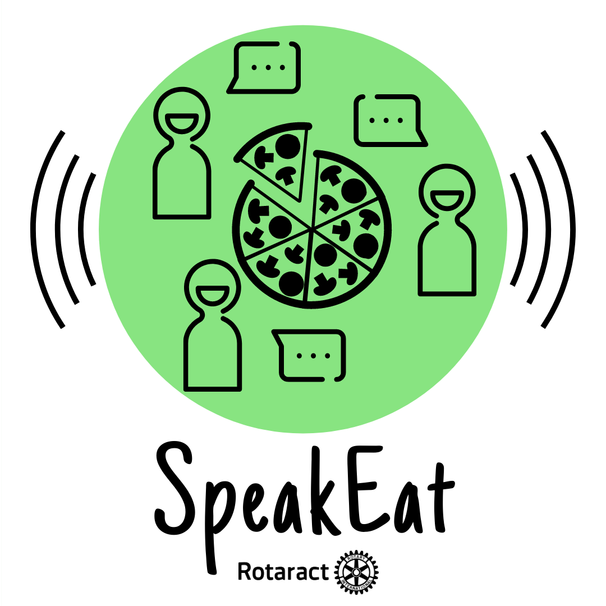

<html>

<head>
    <meta charset="utf-8">
    <meta http-equiv="X-UA-Compatible" content="IE=edge">
    <meta name="viewport" content="width=device-width, initial-scale=1">
    <title>SpeakEat</title>
    <link rel="stylesheet" href="{{ site.baseurl }}/assets/css/mini.css">
    <link rel="stylesheet" href="https://use.fontawesome.com/releases/v5.8.2/css/all.css" integrity="sha384-oS3vJWv+0UjzBfQzYUhtDYW+Pj2yciDJxpsK1OYPAYjqT085Qq/1cq5FLXAZQ7Ay" crossorigin="anonymous">
    
    
</head>

<body class="en">
    

        <a class="js-scroll-trigger" href="https://instagram.com/speak.eat">
            
             
            @speak.eat
             
            SpeakEat Rotaract
             
        </a>
    

     

    <ul>
        <li class="i-s shake">
            <a href="https://univ-grenoble-alpes-fr.zoom.us/j/91040901669?pwd=UHNKVkNUMDl3VkFhU3FwRHQ0U1ZRZz09"><!--https://meet.google.com/vue-vhfn-tec-->
                

                    <i class='fas fa-laptop fa-2x'></i>
                

                

                    Videocall · Visio
                    Sunday · Dimanche · Domingo
                    18:30 UTC+1 (Central EU 🇪🇺)
                    14:30 UTC&minus;3 (BR 🇧🇷)
                

            </a>
        </li>
    </ul>
    <ul>
        <li class="i-s">
            <a href="https://instagram.com/speak.eat">
                

                    <i class='fab fa-instagram fa-2x'></i>
                

                

                    Instagram
                    
                        @speak.eat
                    
                

            </a>
        </li>
    </ul>
    <ul>
        <li class="i-s">
            <a href="https://www.facebook.com/speak.eat.page/events">
                

                    <i class='fab fa-facebook fa-2x'></i>
                

                

                    Facebook (next SpeakEat)
                    
                        (prochain · próximo SpeakEat)
                    
                

            </a>
        </li>
    </ul>
    <ul>
        <li class="i-s">
            <a onclick="window.open('data:text/calendar;charset=utf8,' + escape(icsFile));" target="_blank" style="cursor: pointer;">
                

                    <i class='far fa-calendar-plus fa-2x'></i>
                

                

                    Add to Your Calendar
                    (click for .ICS, or choose below)
                

            </a>
        </li>
    </ul>
    <ul>
        <li class="i-v" style="margin: 0 8px 8px;">
            <a onclick="window.open(urlGoogle);" target="_blank">
                

                    Google
                

            </a>
        </li>
        <li class="i-v" style="margin: 0 8px 8px;">
            <a onclick="window.open(urlOutlook);" target="_blank">
                

                    Outlook
                

            </a>
        </li>
        <li class="i-v" style="margin: 0 8px 8px;">
            <a onclick="window.open(urlOffice);" target="_blank">
                

                    Office 365
                

            </a>
        </li>
    </ul>
    <ul>
        <li class="i-s">
            <a href="#topics">
                

                    <i class='fas fa-list-ol fa-2x'></i>
                

                

                    List of Topics
                    
                        Thèmes · Temas
                    
                

            </a>
        </li>
    </ul>
    

    <ul>
        <li class="i-v">
            <a onclick="document.body.className='en'">
                

                    &nbsp;EN&nbsp;
                

            </a>
        </li>
        <li class="i-v">
            <a onclick="document.body.className='fr'">
                

                    &nbsp;FR&nbsp;
                

            </a>
        </li>
        <li class="i-v">
            <a onclick="document.body.className='pt'">
                

                    &nbsp;PT&nbsp;
                

            </a>
        </li>
    </ul>
    <ul>
        <li class="i-s">
            <a lang="en">
                

                    Hello 😉
                      
                    ❇️ Welcome to SpeakEat, a Rotaract project aiming to promote the exchange of knowledge and experiences!
                      
                    👥 We will have 2 hours together to get to know each other and exchange around the main topic.
                      
                    🍓 If you will eat, you can share your plant-based recipe with us all when you present yourself.
                      
                    —
                      
                    💬 The aim of SpeakEat is to encourage conversation about important topics, with respect and goodwill!
                      
                    🌍 It is inspired by the Rotary International cause of promoting peace to foster mutual understanding.
                      
                    😋 It's a conversation similar to Free IC/Vegan Party, but by videocall and with a plant-based snack.
                      
                    🏳️ We start with the main topic, and the participants decide how we will move the conversation forward.
                      
                    —
                      
                    🌐 Share the event with your friends and family! Everyone is welcome!
                      
                    ⁉️ If you have any questions or suggestions, please contact: Iago Felipe Trentin, Emiline Rioux, or Eleonora Patinot.
                

            </a>
            <a lang="fr">
                

                    Salut 😉
                      
                    ❇️ Bienvenue au SpeakEat, un projet Rotaract visant à promouvoir l'échange de connaissances et d'expériences !
                      
                    👥 Nous aurons 2 heures ensemble pour apprendre à nous connaître et échanger autour du thème principal.
                      
                    🍓 Si vous voulez manger, vous pouvez partager votre recette plant-based avec nous tous lorsque vous vous présenterez.
                      
                    —
                      
                    💬 Le but de SpeakEat est d'encourager la conversation sur des sujets importants, dans le respect et la bienveillance !
                      
                    🌍 L'action s'inspire de l'axe du Rotary International de promotion de la paix pour favoriser la compréhension mutuelle.
                      
                    😋 C'est une conversation similaire à Free IC/Vegan Party, mais en visio et avec un petit repas plant-based.
                      
                    🏳️ Nous démarrons par le thème principal, et les participants décident comment nous allons faire avancer la conversation.
                      
                    —
                      
                    🌐 Partagez l'événement à vos proches ! Toustes sont les bienvenu·e·s !
                      
                    ⁉️ Si vous avez des questions ou suggestions, contactez les responsables du SpeakEat :  Iago Felipe Trentin, Emiline Rioux, ou Eleonora Patinot.
                

            </a>
            <a lang="pt">
                

                    Olá 😉
                      
                    ❇️ Bem-vinde ao SpeakEat, projeto do Rotaract que visa promover a troca de conhecimentos e experiências!
                      
                    👥 Nós teremos 2 horas juntos para nos conhecer e conversar sobre o tema principal.
                      
                    🍓 Se você comer conosco, poderá compartilhar a sua receita plant-based no momento em que se apresentar.
                      
                    —
                      
                    💬 O objetivo do SpeakEat é incentivar a conversa sobre temas importantes, com respeito e boa vontade!
                      
                    🌍 Ele é inspirado na causa do Rotary International de promover a paz para fomentar a compreensão mútua.
                      
                    😋 É uma conversa semelhante ao Free IC/Vegan Party, mas em videochamada e com um lanche plant-based.
                      
                    🏳️ Começamos com o tema principal, e os participantes decidem como vamos avançar a conversa.
                      
                    —
                      
                    🌐 Compartilhe o evento com seus amigos e familiares! Todes são bem-vindes!
                      
                    ⁉️ Se você tiver alguma dúvida ou sugestão, pode entrar em contato com: Iago Felipe Trentin, Emiline Rioux, ou Eleonora Patinot.
                

            </a>
        </li>
    </ul>
    

    <ul>
        <li class="i-s">
            

                
            

        </li>
    </ul>

     
     

    
 &copy; SpeakEat Rotaract

     
     
     
     

    
    
    
</body>

</html>
